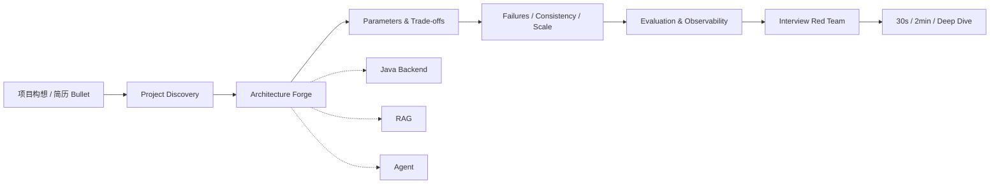
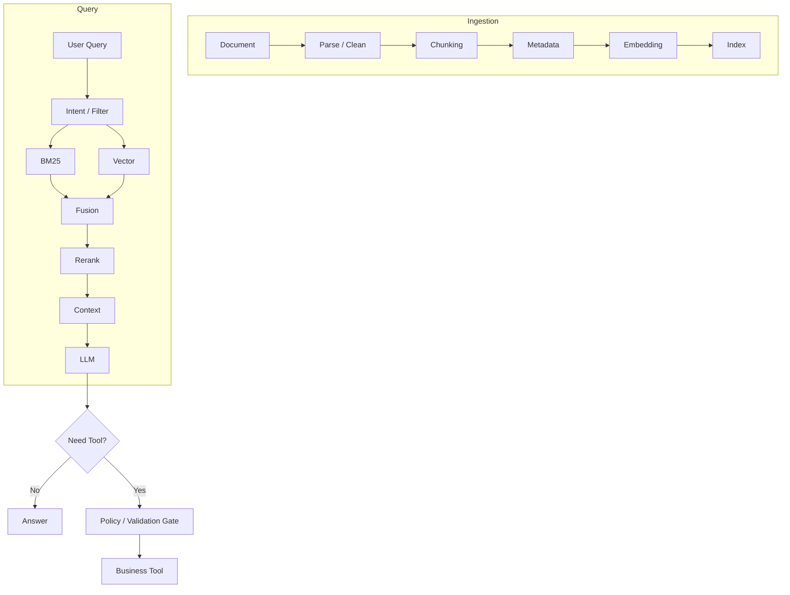

<div align="center">

# ⚡ 快速 Java Skill

### Java Backend × Agent / RAG · Project Reconstruction & Interview Red Team

把一个只有构想、Demo 或零散实现的项目，打磨成 **能讲清架构、能解释参数、能扛连续追问、能设计验证方案** 的高级工程师面试项目。


**Build projects that survive the second question.**

</div>

---

## 为什么会有这个 Skill

很多项目在简历上只有一句：

> “基于 Elasticsearch + RAG + Agent 构建智能客服。”

但高级面试官真正会继续问：

| 表面问题 | 深挖方向 |
|---|---|
| 为什么用 Elasticsearch？ | 为什么不是 Pinecone / Milvus / pgvector？ |
| 为什么做 Hybrid Search？ | BM25 与 Vector 怎么融合？为什么 RRF？ |
| chunk 多大？ | 为什么是这个值？怎么评估？边界怎么处理？ |
| topK 配多少？ | retrieve / rerank / final context 各是多少？ |
| 为什么需要 Agent？ | Workflow 能不能解决？State、Checkpoint、Retry 怎么设计？ |
| 线上慢了怎么查？ | P95 在哪一段？ES、LLM、Tool、线程池谁是瓶颈？ |
| “准确率提升 40%”？ | baseline、数据集、标注方式、指标定义是什么？ |

**快速 Java Skill 的目标，就是提前把这些问题问穿。**

---

## 工作流



### 最终不是一份“漂亮答案”，而是四层结果

```text
Project
├── ① Engineering Reconstruction
│   ├── Architecture / Request Flow / Data Model
│   ├── Parameters / Reliability / Consistency
│   └── Evaluation / Observability / Trade-offs
├── ② Interview Red Team
│   └── 每个关键点连续追问 3～6 层
├── ③ Answer Pack
│   ├── 30 秒回答
│   ├── 2 分钟回答
│   └── Deep Dive
└── ④ Resume Safety Check
    └── 找出无法证明的数字、技术堆砌和危险表述
```

---

## 能力矩阵

| Domain | 会深挖的内容 |
|---|---|
| **Java Backend** | JVM、线程模型、Virtual Threads、CompletableFuture、Spring 事务、MySQL、Redis、Kafka/RocketMQ、ES、幂等、一致性 |
| **RAG** | Chunking、Embedding、BM25、Vector Search、Metadata Filter、Hybrid Search、RRF、Reranker、Recall@K、MRR、NDCG |
| **Agent** | Router、ReAct、Plan-and-Execute、State、Graph、Checkpoint、Tool Schema、Retry、Idempotency、Human-in-the-loop |
| **Production** | Timeout、Retry、Circuit Breaker、Fallback、Hot Key、MQ Backlog、Index Lag、Prompt Injection、Partial Failure |
| **Observability** | traceId、conversationId、Agent span、P50/P95/P99、Token Cost、Retrieval / LLM / Tool latency |
| **Interview** | 技术选型反问、参数依据、规模扩展、故障排查、3～6 层追问链、简历危险点 |

---

## 🚀 Installation

### Option A — 通用 Agent Skills 目录

如果你的 Agent runtime 会从 `~/.agents/skills/` 发现 `SKILL.md`：

```bash
git clone https://github.com/pogacar03/fast-java-skill.git \
  ~/.agents/skills/fast-java-skill
```

以后更新：

```bash
cd ~/.agents/skills/fast-java-skill
git pull
```

### Option B — Claude Code 风格目录

```bash
git clone https://github.com/pogacar03/fast-java-skill.git \
  ~/.claude/skills/fast-java-skill
```

### Option C — 任意支持项目指令 / System Prompt 的 Agent

让 Agent 先读取：

```text
SKILL.md
```

然后根据当前任务按需读取 `references/` 下的对应模块。

> 不同 Agent 产品对 Skill 的安装目录和自动发现机制可能不同。如果没有原生 Skill 机制，直接把 `SKILL.md` 作为项目级指令，并允许它读取同仓库 references 即可。

---

## ⚡ Quick Start

不需要先把项目包装好，直接给最原始的版本：

```text
请用 fast-java-skill 深挖这个项目：

我做了一个运动器材电商智能客服，Java 后端，
用 Elasticsearch 做 RAG，Agent 可以查商品和订单。
现在很多参数和生产细节我说不清。
```

Skill 不应该马上输出一大段“项目亮点”，而会先做：

```text
1. 我理解的项目定位
2. 最值得深挖的 3～5 个模块
3. 当前工程空白
4. 最多 3～5 个会改变架构的问题
5. 信息足够时，明确假设后直接推进
```

随后进入：

```text
Architecture
→ Request Flow
→ Parameters
→ Reliability / Consistency
→ Failure Scenarios
→ Evaluation / Observability
→ Trade-offs
→ Interview Red Team
→ Answer Pack
```

完整示例：[`examples/sports-commerce-rag.md`](examples/sports-commerce-rag.md)

---

## 这个 Skill 和普通“面试提示词”有什么不同

### 1. 参数必须具体，但不能把 baseline 当真理

不接受：

> “topK 设置一个合适的值。”

更希望得到：

```text
initial retrieval: 20–50
rerank candidates: 10–30
final context: 3–8 chunks
```

然后继续解释：**为什么、合理范围、怎么调、看什么指标、什么时候停止增加。**

参数规则见：[`references/parameter-baselines.md`](references/parameter-baselines.md)

### 2. 不为了“高级”而堆技术

如果同步调用已经够用，就要质疑为什么加 Kafka；如果 deterministic workflow 已经够用，就要质疑为什么上 Multi-Agent。

### 3. 架构必须能走完整请求链

不仅画框图，还必须说清：

```text
input / output
sync / async
timeout / retry
idempotency
consistency
fallback
logs / metrics / traces
```

### 4. 高风险 Agent Tool 不能“模型说调就调”

类似退款、取消、修改订单的操作至少要经过：

```text
LLM proposal
→ schema validation
→ auth / ownership
→ business-rule validation
→ idempotency / version check
→ confirmation / policy gate
→ Tool execution
→ durable result / audit
```

### 5. 工程深度不等于虚构经历

Skill 可以把一个构想补成生产级设计，也可以设计 benchmark、压测、故障注入和 evaluation；但不会凭空制造无法验证的真实线上事故、QPS、收入或业务提升数字。

---

## Interview Red Team

普通题库是：

```text
Q1
Q2
Q3
```

这个 Skill 更强调**因果追问链**：

```text
为什么 Elasticsearch 而不是 Pinecone？
    ↓
为什么这个业务需要 lexical + semantic？
    ↓
BM25 和 vector 怎么融合？
    ↓
为什么 RRF？
    ↓
candidate / topK 怎么定？
    ↓
如何证明参数有效？
    ↓
1000 万文档后哪里先出问题？
```

核心决策要求能够承受 **3～6 层连续追问**。

详见：[`references/interview-red-team.md`](references/interview-red-team.md)

---

## RAG / Agent Deep Dive



重点覆盖：

- structural / semantic chunking；
- embedding dimensions 与 similarity；
- BM25 + dense vector + metadata filter；
- RRF / reranking；
- retrieval vs generation failure analysis；
- ReAct vs Plan-and-Execute；
- State / Checkpoint / Resume；
- Tool timeout / retry / idempotency；
- prompt injection / side-effect safety；
- Agent evaluation / token cost / tracing。

详见：[`references/rag-agent.md`](references/rag-agent.md)

---

## Repository Structure

```text
fast-java-skill/
├── SKILL.md                         # 入口：短、可发现、可执行
├── references/
│   ├── project-reconstruction.md    # 项目重构主流程
│   ├── java-backend.md              # Java / 分布式专项
│   ├── rag-agent.md                 # RAG + Agent 专项
│   ├── interview-red-team.md        # 高级面试追问协议
│   └── parameter-baselines.md       # 参数 baseline 与调优思路
├── examples/
│   └── sports-commerce-rag.md       # 运动器材客服示例
├── tests/
│   └── skill-evals.md               # Skill 压力测试场景
├── docs/
│   ├── maintainer-guide.md          # 后续维护 / 扩展
│   └── superpowers/
│       ├── specs/
│       └── plans/
├── CHANGELOG.md
└── CONTRIBUTING.md
```

---

## 常见使用方式

<details>
<summary><b>项目只有构想，还没真正想清楚工程细节</b></summary>

直接把最原始想法丢进来。Skill 会先识别缺口，再补完整链路，而不是要求你先写一份“成熟项目介绍”。

</details>

<details>
<summary><b>项目做过一部分，但很多参数只是默认值</b></summary>

重点进入 Parameter Review：参数初始值、范围、调优指标、规模变化后的影响，以及面试官会怎么追问。

</details>

<details>
<summary><b>简历已经写好了，想知道哪里最容易被问穿</b></summary>

进入 Resume Safety Check + Interview Red Team，优先攻击无法量化、无法解释、技术堆砌和因果关系过强的描述。

</details>

<details>
<summary><b>临近面试，只想模拟高级面试官连续追问</b></summary>

要求进入 `Interviewer Mode`。Skill 会一题一题追，而不是先把答案全泄露给你。

</details>

---

## 维护方式

这不是一次性 Prompt。

建议按领域持续维护：

- 新增某技术的深挖规则 → `references/`
- 新增可复用项目案例 → `examples/`
- 发现 Skill 容易被绕过的场景 → 先更新 `tests/skill-evals.md`
- 修改核心触发方式 / 主行为 → `SKILL.md`
- 行为变更 → 同步 `CHANGELOG.md`

详见：[`docs/maintainer-guide.md`](docs/maintainer-guide.md)

---

## Roadmap

- [ ] Elasticsearch / Hybrid Search 专项追问题库
- [ ] AgentScope / LangGraph 编排模板
- [ ] Java 高并发参数调优专项
- [ ] RAG Evaluation 实战模板
- [ ] 面试模拟评分 Rubric 扩展
- [ ] 简历项目 Risk Score 规则
- [ ] 更多项目案例：交易、物流、Agent 数据分析、异步任务系统

---

## Contributing

欢迎通过 Issue / PR 补充：

- 真正能问穿候选人的高级追问；
- 某类系统常见的生产故障；
- 参数调优与 evaluation 方法；
- Java / Agent / RAG 新工程模式；
- 能暴露 Skill 缺陷的 pressure scenario。

请先阅读 [`CONTRIBUTING.md`](CONTRIBUTING.md)。

---

<div align="center">

### ⚡ Fast Java Skill

**Architecture · Parameters · Failures · Evaluation · Interview**

不是把项目包装得更复杂，
而是把每个复杂度都解释清楚。

</div>
