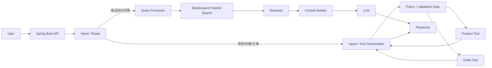

# Example — 运动器材电商智能客服

这个示例展示 `fast-java-skill` 如何把一句模糊项目描述扩展成可被高级面试官连续追问的工程方案。

> **输入：**
>
> “我做了一个运动器材电商智能客服，Java 后端，用 Elasticsearch 做 RAG，Agent 可以查询商品和订单。很多参数我没想清楚。”

---

## 1. Project Discovery

### 项目定位

面向运动器材电商的售前 + 售后智能客服：

- 商品说明、安装、使用、维护、故障 FAQ → RAG；
- SKU、型号、错误码 → lexical / structured retrieval；
- 商品筛选、库存、订单状态 → business Tool；
- 退款、取消等高风险写操作 → deterministic policy gate + Tool，而不是自由 Agent 直接执行。

### 最值得深挖的模块

1. 商品文档 ingestion / chunking；
2. Elasticsearch Hybrid Retrieval；
3. Reranker 与 RAG evaluation；
4. Agent Router + Tool safety；
5. Java 后端的超时、幂等、观测和降级。

### 当前工程空白

- chunk 边界和 metadata 没定义；
- ES 是纯 vector 还是 BM25 + vector 未说明；
- topK / rerank 参数没有依据；
- Agent 为什么存在以及哪些操作不能交给 Agent 未说明；
- 没有 evaluation dataset；
- Tool timeout / retry / idempotency 未定义；
- 缺少一次完整请求链和 failure path。

### 会改变架构的关键问题

最多先确认：

1. 商品事实的 source of truth 是 MySQL/商品服务还是 ES？
2. Agent 除了读订单，是否允许取消/退款等写操作？
3. 文档规模和查询并发大致处于 1 万、100 万还是 1000 万 chunk 量级？
4. 是否存在多租户 / 权限隔离？

如果用户暂时没有数据，明确假设后继续，而不是停在提问阶段。

---

## 2. Recommended architecture

假设：单电商平台、商品事实由业务 DB/服务负责、ES 负责检索、Agent 可读订单但高风险写操作需要确认与业务校验。



### 为什么商品客服适合 Hybrid Search

商品客服同时包含：

```text
精确词：X200 / SKU / E07 / 零件编号
语义词：跑起来有怪声音 / 适不适合体重大的人
```

因此：

- BM25 擅长 exact lexical evidence；
- dense vector 擅长 paraphrase / semantic intent；
- metadata filter 负责 product_id/category/version/access 等硬约束；
- fusion 后再 rerank，提高最终上下文排序质量。

这比“所有问题都 vector search”更符合业务数据特征。

---

## 3. Document ingestion

### 商品数据拆分原则

结构化事实不要只依赖 embedding：

```text
price
stock
weight_limit
model
category
```

这些由商品数据库/服务维护，需要时用 Tool 或 metadata filter。

说明知识做 RAG：

```text
基础介绍
规格说明
安装
使用
维护
故障排查
兼容配件
售后 / FAQ
```

### Chunk strategy

优先：

```text
section / heading
→ paragraph
→ semantic boundary
→ max token fallback
```

第一版实验 baseline：

```text
target: 200–400 tokens
min:    80–120
max:    500–700
overlap: 30–60 tokens / ~1 sentence
```

每个 chunk 带：

```text
product_id
product_name
category
section
document_id
document_version
language
```

FAQ 可以明显更短；连续安装步骤不能为了凑统一长度被拆碎。

---

## 4. Retrieval pipeline

```text
Query
→ product/model/filter extraction when possible
→ BM25 candidates
→ vector candidates
→ fusion
→ dedup
→ rerank
→ context top N
→ LLM
```

### 初始实验参数

不是生产最优值，只是起跑线：

```text
BM25 candidates: 20–50
Vector candidates: 20–50
Fusion candidates for rerank: 10–30
Final context: 3–8 chunks
```

如果 Recall@K 低：先扩大召回或修 query/filter；如果正确文档已经召回但最终丢失：检查 fusion/reranker；如果答案仍不 grounded：检查 context/prompt/generation，而不是无限增大 topK。

---

## 5. Example request flow

用户：

> “X200 跑步机跑的时候一直有异响，怎么办？”

### Flow

1. Spring Boot 接入请求，生成 `traceId` / `conversationId`。
2. Router 判断为商品故障知识问答，无业务写操作。
3. Query processor 提取 `X200` 作为 product/model 约束。
4. ES 同时执行：
   - lexical：`X200`、异响等；
   - semantic：自然语言 query embedding；
   - metadata：限制 X200 / 当前文档版本。
5. fusion 后获取候选，reranker 精排。
6. Context Builder 做重复 chunk 控制和 token budget 控制。
7. LLM 只能根据证据生成；证据不足则询问症状或升级人工。
8. 返回答案和可追踪引用。

### Observability

至少记录：

```text
total_latency
retrieval_latency
rerank_latency
llm_latency
retrieved_chunk_ids
rerank_scores/model info
token usage
answer status
```

当回答错时，可以判断是“没召回”还是“召回了但 LLM 答错”。

---

## 6. Order Tool path

用户：

> “帮我把刚买的跑步机订单退掉。”

不应该：

```text
LLM → refund(orderId)
```

应该至少：

```text
LLM proposes intent/params
→ authenticated user context
→ order ownership validation
→ order state / refund-rule validation
→ explicit confirmation or configured policy gate
→ idempotency key / operation record
→ refund/cancel Tool
→ persist/audit result
→ response
```

如果 Tool timeout 后结果未知，先按 idempotency key / operation status 查结果，再决定是否重试。

---

## 7. Evaluation design

构建例如 300–1000 条代表性客服问题作为逐步扩大的测试集，并按类型分层：

```text
SKU / exact-code
semantic paraphrase
规格参数
安装步骤
故障排查
跨产品歧义
证据不足
订单 Tool
unsafe write request
```

每条标注：

```text
expected document/chunk
expected structured filter
expected Tool if any
expected answer facts / refusal / escalation
```

### Retrieval

- Recall@5 / Recall@10
- MRR
- NDCG when relevance is graded
- latency

### Generation / task

- groundedness / faithfulness
- answer relevance
- citation correctness
- unsupported-claim rate
- Tool selection / argument correctness
- unsafe-action rate

不要把“最终回答准确率”一个数字混掉所有失败类型。

---

## 8. Production failure example

### Symptom

用户反馈查询突然变慢，应用 P95 从正常水平明显升高。

### Narrowing

```text
API total span
→ retrieval span
→ ES lexical/vector subspans
→ rerank span
→ LLM span
```

如果主要耗时集中在 ES vector search：

- 检查 query concurrency / thread pools / queue；
- 慢查询、segment/merge、磁盘和 CPU；
- filters 是否导致 candidate behavior 变化；
- ANN candidate breadth 是否被调大；
- shard topology / node hotspot；
- 最近 reindex 或 ingestion spike。

### Mitigation examples

- 降低非必要 candidate breadth；
- 对特定 exact query 跳过昂贵路径；
- 限流/隔离 ingestion；
- 暂时 fallback 到 lexical + cache if business acceptable；
- 根据已确认 root cause 再做 topology/index-level fix。

重点是先用 span 定位，不是看到慢就直接“加机器”。

---

## 9. Interview follow-up chain

**Q1：为什么选 Elasticsearch 而不是 Pinecone？**

30 秒核心：商品客服不仅有语义搜索，还有 SKU、型号、错误码等 lexical exact-match 场景；如果团队已有 ES 搜索基础设施，ES 能在一个检索系统里完成 BM25、vector、filter 和 hybrid。Pinecone 在托管向量检索上更直接，但这里 lexical + semantic 的组合价值更高。

**Q2：为什么不能纯 vector？**

因为 `E07`、`X200`、SKU 这类 token 的语义空间不一定比 lexical matching 更可靠；pure vector 也不适合替代硬 metadata constraints。

**Q3：BM25 和 vector 怎么融合？**

可以先分别召回，再用 rank fusion，例如 RRF；相比直接线性加权 raw scores，rank fusion 不需要先假设两种 score 可直接比较。是否优于 weighted fusion 要通过 query set 验证。

**Q4：RRF / topK 参数怎么证明？**

不是背固定值。先设置 candidate baseline，在 exact / semantic / mixed query slices 上比较 Recall@K、MRR/NDCG、rerank latency 和最终 grounded answer，找到收益开始饱和的位置。

**Q5：1000 万 chunk 后怎么办？**

重新验证 shard/index topology、vector memory/disk、candidate cost、metadata filter selectivity、ingestion/reindex、recovery target 和 query concurrency；不能只说“ES 水平扩容”。

---

## 10. Resume-safe formulation

比起无法证明的：

> “通过 RAG 将客服准确率提升 40%。”

如果尚未完成可靠 measurement，更稳妥的是：

> “设计商品知识 RAG 链路，结合 Elasticsearch BM25 + Vector Hybrid Retrieval、metadata filtering 与 reranking，并构建分层客服 query evaluation 方案评估 Recall@K、MRR、groundedness 与 Tool 执行正确性。”

技术深度仍然存在，但不会留下一个一追问就无法证明的数字。
